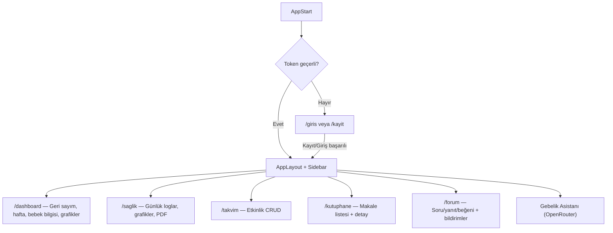

# Bebeğim — Gebelik Takip: Geliştirme Planı (Güncel)

## Kapsam ve hedef

- **Kaynaklar:** `PRD.md`, `PROJE_KURULUM_VE_TEKNOLOJILER.md`
- **Stack:** Vite + React (TypeScript) · FastAPI · PostgreSQL (Supabase)
- **Auth:** JWT (`python-jose` + `passlib`/bcrypt) 
- **Kritik akış:** Kayıt (2 adım) → Dashboard → Sağlık / Takvim / Kütüphane / Forum / Gebelik Asistanı

---

## Ürün akışları (sayfa seviyesinde)

### Auth

| Ekran | Açıklama |
|-------|----------|
| `/giris` | E-posta + şifre girişi |
| `/kayit` | **Adım 1:** Ad soyad, e-posta, şifre · **Adım 2:** SAT + başlangıç kilosu |

Kayıt sonrası JWT üretilir; kullanıcı doğrudan `/dashboard`'a yönlendirilir. Token `sessionStorage`'da tutulur.

### Ana navigasyon (sidebar)

| Menü | Rota |
|------|------|
| Dashboard | `/dashboard` |
| Sağlık Takibi | `/saglik` |
| Takvim | `/takvim` |
| Kütüphane | `/kutuphane` |
| Forum | `/forum` |
| Gebelik Asistanı (AI) | `/bebegimle-konus` |

---

## Sayfa / Özellik detayları

### Dashboard (`/dashboard`)

- Beklenen doğum tarihine geri sayım
- Hafta/gün ve trimester hesabı (SAT üzerinden)
- `weekly_metadata` tablosundan bebek boyutu, ağırlığı ve meyve/nesne kıyası
- Hero metni: haftalık `baby_size` ile dinamik özet cümle
- Özet kartları: son tansiyon, son kan şekeri, bebek bilgisi
- Kilo trend grafiği (X: tarih `gg/aa`, Y: kilo)
- Yaklaşan takvim etkinlikleri
- Gebelik Asistanı yönlendirme CTA

**API:** `GET /dashboard` · `GET /get-current-status` · `GET /pregnancy/status`

### Sağlık Takibi (`/saglik`)

- Günlük log girişi: tarih, kilo, tansiyon (sis/diy), kan şekeri, nabız, su, not
- Ters kronolojik liste; riskli tansiyon (>140/90) görsel vurgu
- Trend grafikleri: kilo, tansiyon, kan şekeri
- Tarih aralığı seçerek PDF raporu indirme (ReportLab stream, kalıcı dosya yok)
- Gelecek tarihli kayıt backend'de engellenir

**API:** `GET/POST/PUT/DELETE /measurements` · `GET /measurements/charts` · `GET /health/measurements/summary` · `GET /health/measurements/trends/{type}` · `GET /reports/pdf?start_date=...&end_date=...`

### Takvim (`/takvim`)

- Randevu / etkinlik CRUD
- Türkçe locale (`date-fns/locale/tr`), hafta Pazartesi başlar

**API:** `GET/POST/PUT/DELETE /calendar/events`

### Kütüphane (`/kutuphane`)

- Kategori bazlı makale listesi ve detay
- Markdown render (`react-markdown`)
- Beğeni (like) desteği

**API:** `GET/POST/PUT/DELETE /library/articles` · like uçları

### Forum (`/forum`)

- Soru listesi, detay, yanıt, beğeni
- Zaman etiketi: Bugün / Dün / tam tarih (`created_at` üzerinden)
- Uygulama içi bildirimler: yorum ve beğeni (üst çubukta `NotificationDropdown`)

**API:** `GET/POST /forum` · `GET/PUT/DELETE /forum/questions/{id}` · yanıt & beğeni uçları · `GET /notifications` · `PATCH /notifications/{id}/read`

### Gebelik Asistanı (`/bebegimle-konus`)

- OpenRouter üzerinden LLM; tarayıcı doğrudan modele bağlanmaz
- Sol panel: sohbet geçmişi · Sağ panel: aktif sohbet
- Kişisel sağlık verisi yalnızca seçici olarak bağlama eklenir
- Türkçe, destekleyici ton; teşhis/ilaç önerisi yok; riskli belirtide doktora yönlendirme
- Model: `openai/gpt-oss-120b:free` (OpenRouter ücretsiz katman)

**Akış:**
```
BabyChat.tsx
  → POST /api/v1/chat/sessions/{id}/assistant
    → assistant_service.py (sistem promptu + bağlam)
      → openrouter_client.py
        → openrouter.ai/api/v1/chat/completions
          → yanıt chat_messages tablosuna yazılır
```

**API:** `GET/POST/DELETE /chat/sessions` · `GET/POST /chat/sessions/{id}/messages` · `POST /chat/sessions/{id}/assistant`

---

## Backend (FastAPI) — API uçları özeti

### Auth
- `POST /auth/register`
- `POST /auth/login`
- `POST /auth/logout`
- `GET/PATCH/DELETE /auth/me`

### Uygulama
- `GET /dashboard` · `GET /get-current-status` · `GET /pregnancy/status`
- `GET/POST/PUT/DELETE /measurements` · grafik ve özet uçları
- `GET /reports/pdf`
- `GET/POST/PUT/DELETE /calendar/events`
- `GET/POST/PUT/DELETE /library/articles` + like uçları
- `GET/POST /forum` · soru/yanıt/beğeni/rapor uçları
- `GET /notifications` · `PATCH /notifications/{id}/read`
- `GET/POST/DELETE /chat/sessions` · mesaj uçları · `/assistant`

Tüm uçlar: `/api/v1/...`  
Döküman: `http://127.0.0.1:8000/docs`

---

## Veri modeli (PostgreSQL)

| Tablo | Amaç |
|-------|------|
| `users` | Profil, SAT, EDD (SAT + 280 gün), başlangıç kilosu |
| `tokens` | JWT oturum kayıtları |
| `daily_logs` | Kilo, tansiyon, kan şekeri, nabız, su, not |
| `weekly_metadata` | 1–42 hafta statik bebek/semptom verisi (seed) |
| `calendar_events` | Takvim randevuları |
| `library_articles`, `library_likes` | Kütüphane içeriği ve beğeniler |
| `forum_threads`, `forum_replies`, `forum_likes` | Forum |
| `notifications` | Forum bildirimleri (uygulama içi) |
| `chat_sessions`, `chat_messages` | Danışma AI sohbetleri |

Detay: `prodocs/veritabani-yapisi.md`

---

## Ortam değişkenleri

### `backend/.env`

```env
DATABASE_URL=postgresql://...
OPENROUTER_API_KEY=sk-or-v1-...
OPENROUTER_MODEL=openai/gpt-oss-120b:free
OPENROUTER_HTTP_REFERER=http://localhost:8080
OPENROUTER_APP_TITLE=Gebelik Asistani
```

### `frontend/.env`

```env
VITE_API_URL=http://localhost:8000/api/v1
```

---

## Güvenlik / KVKK

- JWT kimlik doğrulama; şifreler bcrypt hash
- Sağlık verileri KVKK/GDPR kapsamında hassas
- Frontend doğrudan veritabanına bağlanmaz; tüm erişim FastAPI üzerinden
- `.env` ve API anahtarları repoya eklenmez
- Token `sessionStorage`'da tutulur (sekme kapanınca oturum biter)

---

## Test planı (MVP)

| Alan | Senaryo |
|------|---------|
| Auth | Kayıt/giriş/çıkış, token expire, duplicate e-posta |
| Onboarding | SAT→EDD 280 gün hesabı, gelecek tarih engeli |
| Status | Hafta/gün/trimester, 40+ hafta edge case |
| Sağlık logları | Ters kronoloji, riskli tansiyon vurgusu (>140/90), gelecek tarih engeli |
| PDF | Stream çıktısı, boş aralık 404 |
| Forum bildirimleri | Yorum/beğeni bildirimi, okundu işaretleme |
| Danışma AI | 503 (anahtar yok), 502 (OpenRouter hatası), 504 (zaman aşımı) |

---

## Uç durumlar

| Durum | Beklenen davranış |
|-------|-------------------|
| Gelecek tarihli sağlık kaydı | Backend'de engellenir |
| Doğum tarihi geçti | 40+ hafta gösterimi |
| `weekly_metadata` kaydı yok | "Bilgi bulunamadı" |
| `OPENROUTER_API_KEY` yok | Sohbet 503 |
| PDF aralığında kayıt yok | 404 |

---

## Uygulama akış şeması



---

## MVP dışı / sonraki sürüm

- Birim dönüşümü (cm/gr ↔ inch/lb)
- Gelişmiş forum moderasyon paneli
- Mobil native uygulama (React Native)
- E2E test ve CI/CD otomasyonu
- Push bildirimleri

---

> **Not:** İlk plan Expo/React Native, Firebase Auth/FCM ve tekke/kasılma sayaçları öngörüyordu.
> Güncel ürün **Vite + React web uygulamasıdır**; auth JWT, bildirimler yalnızca uygulama içi forum bildirimleridir.
> Mobil uygulama ve push bildirimler sonraki sürüm kapsamına alındı.
