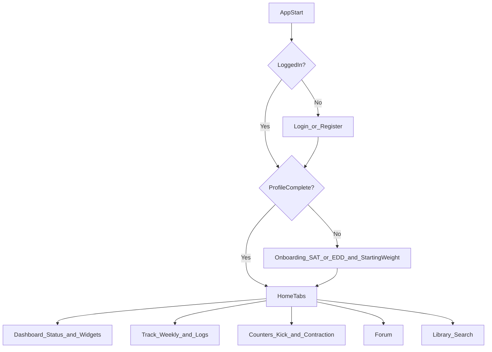

# Gebelik Takibi MVP geliştirme planı

## Kapsam ve hedef

- Kaynaklar: `[PRD.md](C:/Users/CASPER/Desktop/gebeliktakip/PRD.md)` ve `[MVP.md](C:/Users/CASPER/Desktop/gebeliktakip/MVP.md)`.
- Stack: **Expo (React Native) + FastAPI + PostgreSQL**.
- Auth: **Firebase Authentication (email+password)**.
- Kritik akış: **Giriş/Üyelik → İlk kurulum (onboarding/profil) → Dashboard**.

## Ürün akışları (ekran seviyesinde)

- **Auth**
  - `LoginScreen`: email + şifre → giriş
  - `RegisterScreen`: ad-soyad + email + şifre → üyelik
- **İlk kullanım / Profil oluşturma (zorunlu)**
  - `OnboardingStepDate`: **SAT** (son adet tarihi) veya **Beklenen Doğum Tarihi (EDD)** seçimi
    - SAT girildiyse EDD = SAT + 280 gün
    - EDD girildiyse SAT = EDD - 280 gün
  - `OnboardingStepStartingWeight`: başlangıç kilosu (grafik başlangıcı için)
  - (Opsiyonel ama önerilen) `OnboardingStepBasics`: doğum tarihi, boy, risk bilgisi (sonra genişletilebilir)
  - Onboarding tamamlanmadan ana uygulamaya geçiş yok.
- **Ana uygulama sekmeleri (PRD’ye göre)**
  - `Dashboard`: hafta/gün, doğuma kalan gün, trimester + son kilo/tansiyon mini widget
  - `Takip`: haftalık biyolojik rapor + boyut kıyaslayıcı + sağlık logları (kilo/tansiyon)
  - `Sayaçlar`: tekme sayacı + kasılma kronometresi + **5-1-1** uyarısı
  - `Forum`: kategori → thread listesi → thread detay → yorum/şikayet
  - `Kütüphane`: kategori listesi + metin arama

## Backend (FastAPI) planı

- **Kimlik doğrulama**
  - Mobil istemci Firebase ile giriş/üyelik yapar, **ID token** alır.
  - Backend her istek için `Authorization: Bearer <firebase_id_token>` doğrular.
  - Backend tarafında `user_id` olarak Firebase `uid` kullanılır.
- **Temel API uçları (MVP)**
  - `GET /me` profil getir
  - `POST /me/profile` onboarding verilerini kaydet/güncelle (SAT/EDD, starting_weight, ...)
  - `GET /status/current` (PRD 3.2 ile uyumlu): hafta/gün/trimester/geri sayım
  - `POST /logs/weight`, `GET /logs/weight`
  - `POST /logs/blood-pressure`, `GET /logs/blood-pressure`
  - `POST /counters/kick-session`, `POST /counters/contraction-event`, `POST /counters/contraction-session/analyze`
  - `GET /weekly-metadata/{week_number}` (statik haftalık veri)
  - `GET /library/search?q=...` ve kategori uçları
  - Forum için minimum: `GET /forum/categories`, `GET /forum/threads`, `POST /forum/threads`, `POST /forum/replies`, `POST /forum/report`
  - `GET /reports/pdf` (stream): sağlık verilerinden PDF export

## Veri modeli (PostgreSQL)

PRD 3.1’i baz alıp Firebase `uid` ile eşle:

- **users**: `id (uid)`, `email`, `full_name`, `created_at`
- **user_profile**: `user_id`, `last_menstrual_period`, `expected_due_date`, `starting_weight`, `updated_at`
- **daily_logs**: `id`, `user_id`, `date_time`, `weight`, `systolic`, `diastolic`, `pulse`, `water_intake`, `note`
- **weekly_metadata (static)**: `week_number (1..42)`, `fetus_size_cm`, `fetus_weight_gr`, `development_milestones_json`, `symptom_analysis_text`, `comparison_object_name`, `image_url`
- **counter_logs**: `id`, `user_id`, `type`, `start_time`, `end_time`, `duration_seconds`, `frequency_seconds`, `meta_json`
- **forum** (MVP minimal): categories/threads/replies/reports tabloları

Not: PRD’de geçen **“Gebelik Günü”** anahtarını; en azından `status/current` hesaplarında ve loglarda `pregnancy_day_index` alanı olarak opsiyonel ekleyip (ileride ana key’e evrilebilir) hesaplamayı standartlaştır.

## Bildirimler (FCM)

- **Yerel hatırlatıcılar**: Expo Notifications ile cihaz üzerinde.
- **Server-side**: Yeni hafta bildirimleri için cron + FCM (token yönetimi için kullanıcıya ait `fcm_tokens` tablosu).

## Statik haftalık veri (1-42 hafta)

- Kaynak veri seti: `weekly_metadata` seed.
- İlk aşama: metinler + kıyas objesi + görsel URL.
- İkinci aşama: içerikleri admin panel olmadan JSON/CSV seed ile güncelleme.

## Güvenlik / KVKK

- Backend’de token doğrulama zorunlu.
- Sağlık verileri için en azından:
  - DB seviyesinde şifreleme stratejisi (örn. disk encryption + column-level encryption planı)
  - erişim logları
  - veri minimizasyonu

## Test planı (MVP)

- Auth: kayıt/giriş/çıkış, token expire senaryosu.
- Onboarding: SAT/EDD dönüşümü, 280 gün hesabı, edge case (gelecek tarih engeli).
- Status hesaplama: hafta/gün/trimester, 40+ hafta.
- Kilo/tansiyon: ters kronolojik liste, riskli değer vurgusu (>140/90).
- Kasılma: 5-1-1 kuralı uyarısı.
- PDF: stream çıktısı ve içerik doğruluğu.

